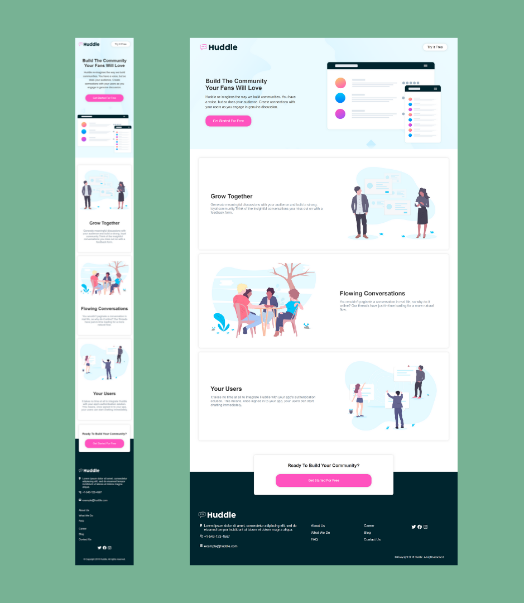

# react-landing-page. Created with CodeSandbox

# Frontend Mentor - Huddle landing page with alternating feature blocks solution

This is a solution to the [Huddle landing page with alternating feature blocks challenge on Frontend Mentor](https://www.frontendmentor.io/challenges/huddle-landing-page-with-alternating-feature-blocks-5ca5f5981e82137ec91a5100). Frontend Mentor challenges help you improve your coding skills by building realistic projects.

## Table of contents

- [Overview](#overview)
  - [The challenge](#the-challenge)
  - [Screenshots](#screenshots)
  - [Links](#links)
- [My process](#my-process)
  - [Built with](#built-with)
  - [What I learned](#what-i-learned)
  - [Continued development](#continued-development)
  - [Useful resources](#useful-resources)
- [Author](#author)

## Overview

### The challenge

Users should be able to:

- View the optimal layout for the site depending on their device's screen size
- See hover states for all interactive elements on the page

### Screenshots

### Links

- Solution URL: [React Landing Page using styled components](https://www.frontendmentor.io/solutions/react-landing-page-using-styled-components-AnG3JXC9xq)
- Live Site URL: [Huddle Landing Page Demo](https://csb-9jk52o.netlify.app/)

## My process

### Built with

- Semantic HTML5 markup
- CSS custom properties
- Flexbox
- Mobile-first workflow
- [React](https://reactjs.org/) - JS library
- [Styled Components](https://styled-components.com/) - For styles

### What I learned

This project is a start for learning React. I watched the React Styled Components Tutorial from Traversy Media. It was a great experience working with this new concept.

### Continued development

This Frontend Mentor challenge was the first one I developed in React. I will continue learning more about React and how to apply new concepts to new projects.

### Useful resources

- [Tutorial from Traversy Media about React Styled Components](https://youtu.be/02zO0hZmwnw) - This tutorial helped me to learn how to create styled-components and how to apply global styles, props, and themes. I'd recommend it to anyone still learning this concept.

- [Codesandbox](https://www.codesandbox.io) - This is a great online code editor. It helped me to develop this project. I liked this platform and will use it going forward.

- [Netlify](https://www.netlify.com) - This tool lets us deploy our projects and share our live sites.

- [Grammarly](https://www.grammarly.com) - It helps me to write this readme in English and correct misspellings.

## Author

- Github - [Codernami](https://github.com/codernami)
- Frontend Mentor - [@codernami](https://www.frontendmentor.io/profile/codernami)
